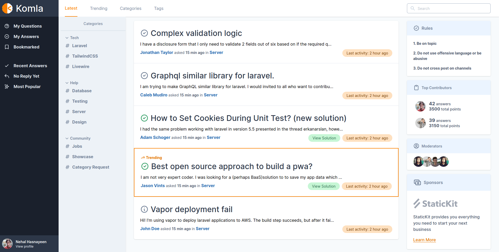

Introducing Komla, a modern forum application built with Laravel.

<b><a href="#about-komla">Overview</a></b>
|
<b><a href="#installation">Installation</a></b>
|
<b><a href="#screenshots-↑top">Screenshots</a></b>
|
<b><a href="#contributing-↑top">Contributing</a></b>
|
<b><a href="#supporting-↑top">Supporting</a></b>
|
<b><a href="#credits-↑top">Credits</a></b>
|
<b><a href="#license-↑top">License</a></b>

## About Komla

Komla is a modern take on forum software with user experience in mind. It is open source and [MIT licensed](https://github.com/iluminar/komla/blob/dev/LICENSE).

## Installation

[Install via docker](https://github.com/iluminar/komla/wiki/Installation#setup-using-docker)

[Install manually](https://github.com/iluminar/komla/wiki/Installation#setup-usual-way-if-youre-not-using-docker)

## Screenshots <small>[↑Top](#about-komla)</small>

## Contributing <small>[↑Top](#about-komla)</small>

Thank you for considering contributing to the Komla Project! The contribution guide can be found in the [Contribution Guideline](https://github.com/iluminar/komla/wiki/Contribution-Guideline).

You can join the Komla Project via this link [link](https://goodworkfor.life/register/invite-link/ovCPAFpnwIhrvqUrlvynarP9HVRBC5mH)

## Supporting <small>[↑Top](#about-komla)</small>

If you need professional support or custom functioanlity please send an e-mail to searching.nehal@gmail.com.

## Security Vulnerabilities <small>[↑Top](#about-komla)</small>

If you discover a security vulnerability within Komla, please send an e-mail to searching.nehal@gmail.com instead of creating new issue. All security vulnerabilities will be promptly addressed.

## Credits <small>[↑Top](#about-komla)</small>

- Author: [Nehal Hasnayeen](https://github.com/Hasnayeen) (https://hasnayeen.github.io)

- Illustrations Credit: [Undraw](https://undraw.co/)

- [Full Contributors List](https://github.com/iluminar/komla/graphs/contributors)

## License <small>[↑Top](#about-komla)</small>

Komla is open-sourced software licensed under the [MIT license](http://opensource.org/licenses/MIT).
